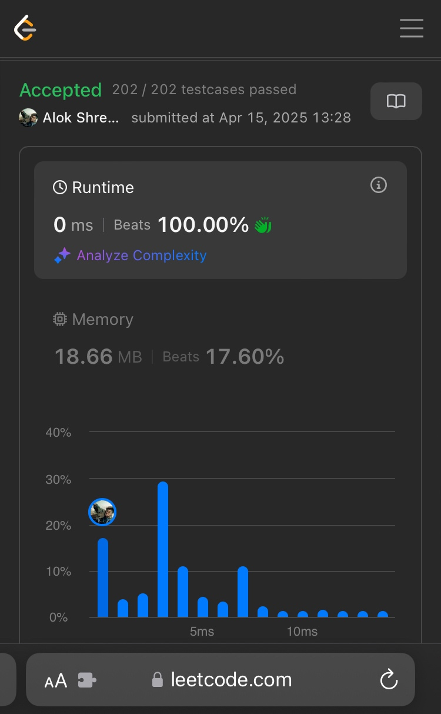
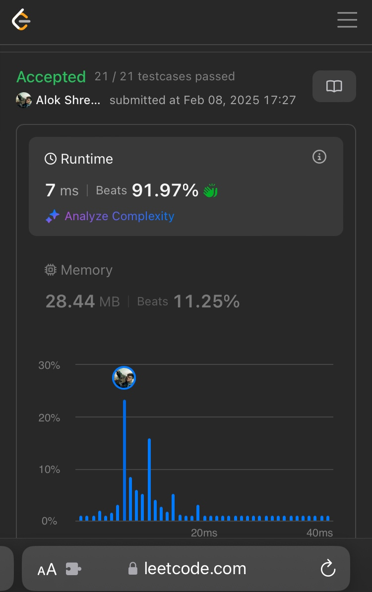

# AboutMe
## A page to reflect on how far I've come and as a self motivator to keep $practicing^{\infty}$
Been hearing a lot on social media around how Leetcode may be dead because of the advent of AI. So, I am deciding to engage around this topic on this readme doc, because what better way to write an `About Me` section for my Git Profile. 

Leetcode: I have been on this platform for quite some time now and I am excited to share my experiences.  

It started with a gnarly time after signing up. I kept approaching a problem with brute force, my execution time sucked, oh and by-the-way, I found no real-world connection to the problems I was trying to solve. At least, I _thought_ I didn't. 

Then, Epiphany. I decided to put in hours, which turned into weeks, turned to months. Dusting away shelfed books I once read back, may be a decade ago. I decided to put in at least 1 problem a week, balancing among all what daily life and work brought.  

It wasn't an immediate result. I had a lower average to begin with, albeit my goal wasn't to improve this average, it was _merely_ just about "let’s see if I can think differently this time". I'd go back to solving the same problem I'd solved few years ago, unknown was how I'd previously solved it. It was during these few new attempts, I had realized my recent solutions were not just different, but the runtimes had gotten faster by a mere 5-10%. Not much, for sure, but for me this was the building block. And to this day, my motivation is still all about it. 

So, no. Leetcode isn't dead. Not if you want to use the platform to train yourself, not if you are willing to put the effort down, burn the late evening oil or early morning, to know where you're at and where you need to improve; and so, I have chosen. 

Note: No AI are used on any of my compilations. 
---

---
---
### Wall of Runtimes: _(On 1st approach), (Med. problems)._ "Do or do not. There is no ~~try~~"
---

